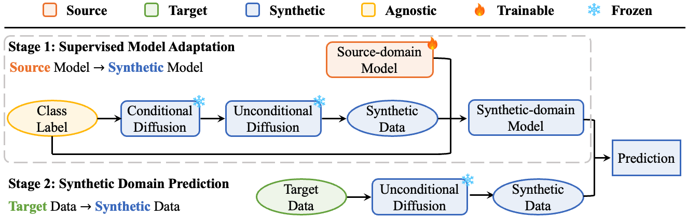
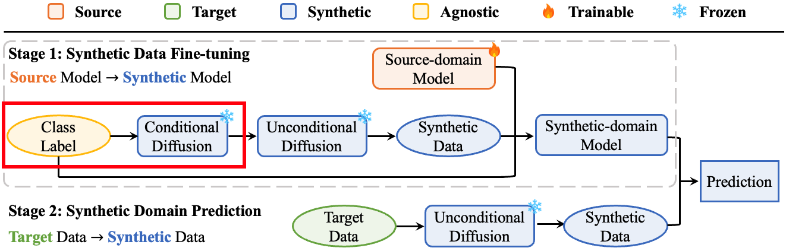

# Diffusion-Driven-Test-Time-Adaptation-with-Synthetic-Domain-Alignment

This repository is the official Pytorch implementation for [SDA](https://arxiv.org/abs/2406.04295). 

[](https://arxiv.org/abs/2406.04295) 

> **Everything to the Synthetic: Diffusion-driven Test-time Adaptation via Synthetic-Domain Alignment**  
> [Jiayi Guo](https://www.jiayiguo.net),
> Junhao Zhao,
> [Chunjiang Ge](https://john-ge.github.io/),
> [Chaoqun Du](https://scholar.google.com/citations?user=0PSKJuYAAAAJ&hl=en)
> [Zanlin Ni](https://scholar.google.com/citations?user=Yibz_asAAAAJ&hl=en),
> [Shiji Song](https://scholar.google.com/citations?user=rw6vWdcAAAAJ&hl=en&oi=ao),
> [Humphrey Shi](https://www.humphreyshi.com),
> [Gao Huang](https://www.gaohuang.net)

<p align="center">


<strong>Sythetic-Domain Alignment (SDA)</strong> is a novel test-time adaptation framework that simultaneously aligns the domains of the <strong>source model</strong> and <strong>target data</strong> with the
same <strong>synthetic domain</strong> of a diffusion model.
</p>

## Overview

<p align="center">


 SDA is a novel two-stage TTA framework aligning both the domains of the source model and the target data with the synthetic domain. In Stage 1, the source-domain model is adapted to a synthetic-domain model through synthetic data fine-tuning. This synthetic data is first generated using a conditional diffusion model based on domain-agnostic class labels, then re-synthesized through an unconditional diffusion process to ensure domain alignment with the projected target data in Stage 2. In Stage 2, target data is projected into the synthetic domain using unconditional diffusion for synthetic-domain model prediction.
</p>

## News
- [2023.06.07] Code, data and models released!

## Setup
### Installation
```
git clone https://github.com/SHI-Labs/Diffusion-Driven-Test-Time-Adaptation-via-Synthetic-Domain-Alignment.git
cd Diffusion-Driven-Test-Time-Adaptation-via-Synthetic-Domain-Alignment
conda env create -f environment.yml
conda activate SDA
pip install torch==1.13.1+cu117 torchvision==0.14.1+cu117 torchaudio==0.13.1 --extra-index-url https://download.pytorch.org/whl/cu117
mim install mmcv-full 
mim install mmcls
```


### Dataset
Download [ImageNet-C](https://github.com/hendrycks/robustness) and generate [ImageNet-W](https://github.com/facebookresearch/Whac-A-Mole) following the official repos. 

For a quick evaluation, also download our re-synthesized ImageNet-C-Syn and ImageNet-W-Syn via [Google Drive](https://drive.google.com/drive/folders/12SR935Quk04Yb0gJg0EDh2UDEzjkGGpq?usp=sharing) or [Tsinghua Cloud](https://cloud.tsinghua.edu.cn/d/f2a16abca58d48ed95c7/). Place all datasets into `data/`.
```
data
|——ImageNet-C
|    |——gaussian_noise
|       |——5 
|           |——n01440764       
|               |——*.JEPG
|——ImageNet-C-Syn
|    |——gaussian_noise
|       |——5 
|           |——n01440764       
|               |——*.JEPG
|——ImageNet-W
|   |——val
|       |——n01440764
|           |——*.JEPG
|——ImageNet-W-Syn
|   |——val
|       |——n01440764
|           |——*.JEPG
```
You can also re-synthesize the test datasets yourself following the official repo of [DDA](https://github.com/shiyegao/DDA) or using our [align.sh](scripts/align.sh).

### Model
Download pretrained checkpoints (diffusion models and classifiers) via the following command:
```
bash scripts/download_ckpt.sh
```
For a quick evaluation, also download our finetuned checkpoints via [Google Drive](https://drive.google.com/drive/folders/12SR935Quk04Yb0gJg0EDh2UDEzjkGGpq?usp=sharing) or [Tsinghua Cloud](https://cloud.tsinghua.edu.cn/d/f2a16abca58d48ed95c7/). Place the checkpoints into `finetuned_ckpt/`.

## Evaluation
We provide example commands to evaluate finetuned models on both ImageNet-C and ImageNet-W:

```
bash scripts/eval.sh
```

You can also test a customized model with the following formats:

```
# ImageNet-C
CUDA_VISIBLE_DEVICES=0 python eval/test_ensemble.py <config> <finetuned ckpt> \
--originckpt <pretrained ckpt> --metrics accuracy --datatype C --ensemble sda --corruption <corruption type> --data_prefix1 data/ImageNet-C --data_prefix2 data/ImageNet-C-Syn

# ImageNet-W
CUDA_VISIBLE_DEVICES=0 python eval/test_ensemble.py <config> <finetuned ckpt> \
--originckpt <pretrained ckpt> --metrics accuracy --datatype W --ensemble sda --data_prefix1 data/ImageNet-W --data_prefix2 data/ImageNet-W-Syn
```
You may need to set up a new config for your customized model according to our evaluation [configs](eval/configs/ensemble).


## Training/Fine-tuning
### Step 1: Synthetic data generation via conditional diffusion
<p align="center">

</p>

Run the following command to generate a synthetic dataset via DiT:
```
bash scripts/gen.sh
```

The synthetic dataset contains the 1000 ImageNet classes, with 50 images per class:
```
data
|——DiT-XL-2-DiT-XL-2-256x256-size-256-vae-ema-cfg-1.0-seed-0
|       |——0000
|       |    |——*.png
|       |——0001
|       |——....
|       |——9999
```

### Step 2: Synthetic data alignment via unconditional diffusion
<p align="center">

</p>

Run the following command to project the synthetic dataset to the domain of ADM:

```
bash scripts/align.sh
```
We also provide example commands to project target data (ImageNet-C/W) to the domain of ADM, which is the same as [DDA](https://github.com/shiyegao/DDA). Check [align.sh](scripts/align.sh) for more details.

### Step 3. Synthetic data fine-tuning
<p align="center">

</p>

**Important**: Our fine-tuning code is constructed based on [MMPreTrain](https://github.com/open-mmlab/mmpretrain), which conflicts with the mmcv version used in the data alignment (Step 2) built on [DDA](https://github.com/shiyegao/DDA). Therefore, it is necessary to set up a new environment before fine-tuning:

```
conda env create -f environment_ft.yml
conda activate SDA-FT
pip install torch==1.13.1+cu117 torchvision==0.14.1+cu117 torchaudio==0.13.1 --extra-index-url https://download.pytorch.org/whl/cu117
mim install mmcv
```

We provide fine-tuning [configs](mmpretrain/configs/_SDAconfigs) for five models used in our paper. Run the following command to start synthetic data fine-tuning:
```
bash scripts/finetune.sh
```
In our implementation, we use a 30-epoch fine-tuning scheduler. Empirically, we find that 15 epochs of training is sufficient for evaluation.

If you want to fine-tune different models, please refer to [mmpretrain](https://mmpretrain.readthedocs.io/en/latest/user_guides/config.html) to set up a new config.


## Results

* ImageNet-C
<p align="center">

</p>

* ImageNet-W
<p align="center">

</p>

* Visualization: Grad-CAM results with prediction
classes and confidence scores displayed above the images.
<p align="center">

</p>

## Citation

If you find our work helpful, please **star 🌟** this repo and **cite 📑** our paper. Thanks for your support!

```
@article{guo2024sda,
  title={Everything to the Synthetic: Diffusion-driven Test-time Adaptation via Synthetic-domain Alignment},
  author={Jiayi Guo and Junhao Zhao and Chunjiang Ge and Chaoqun Du and Zanlin Ni and Shiji Song and Humphrey Shi and Gao Huang},
  journal={arXiv},
  year={2024}
}
```

## Acknowledgements
We thank [MMPretrain](https://github.com/open-mmlab/mmpretrain) (model fine-tuning), [DiT](https://github.com/facebookresearch/DiT) (data synthesis) and [DDA](https://github.com/shiyegao/DDA) (data alignment).

## Contact
guo-jy20 at mails dot tsinghua dot edu dot cn